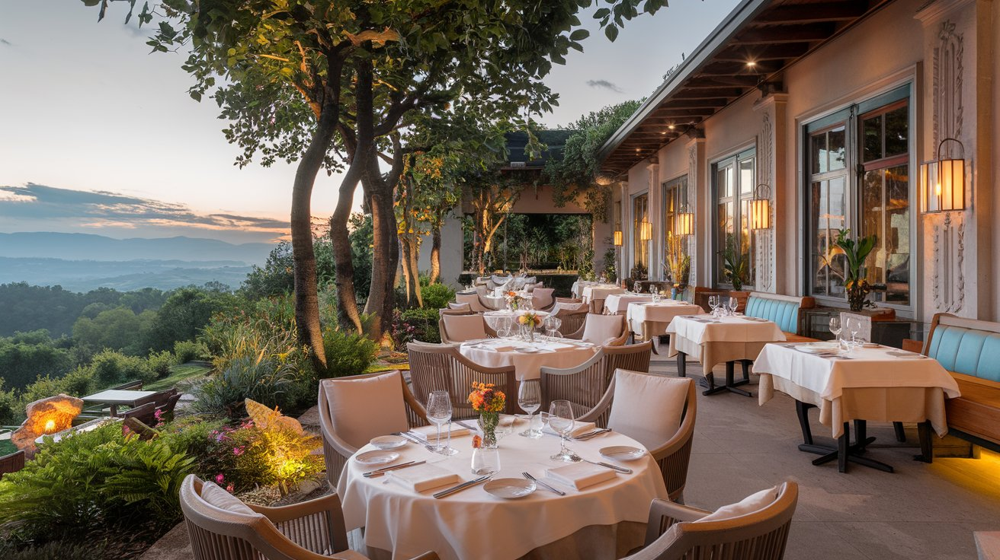
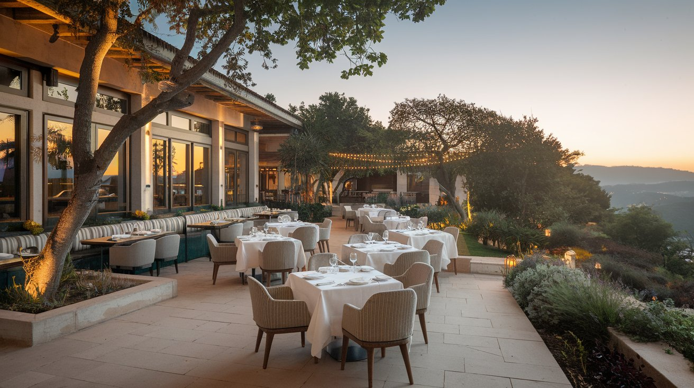
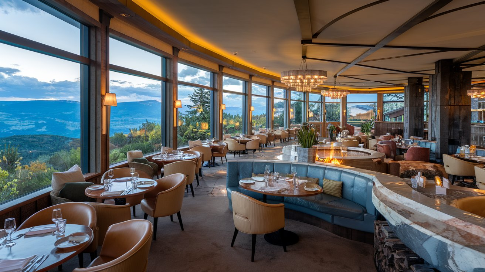
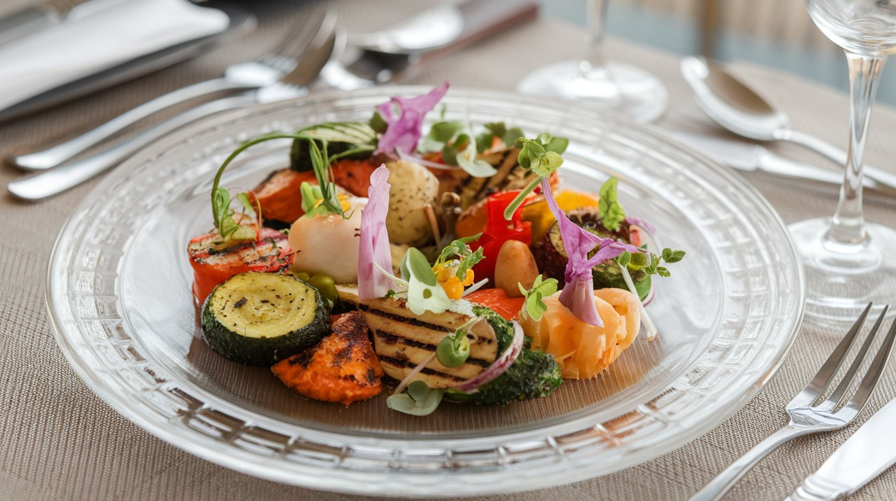
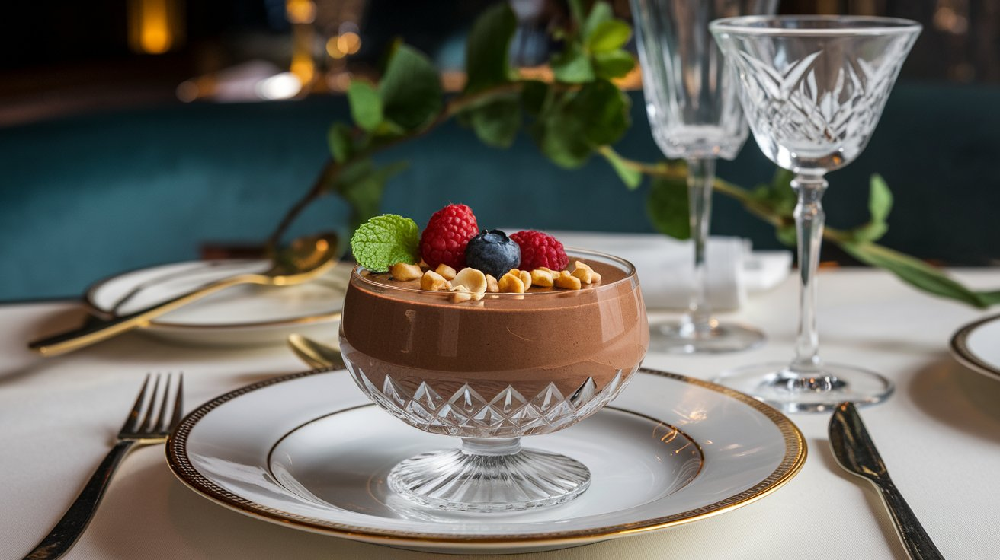

## Projeto 3 - Landing Page | <a href="https://essenza-verde-alessandra-mairis-nfppvsn8l.vercel.app/" target="_blank">visite</a> | 

 # 🌱 Essenza Verde  - Restaurante Vegano/Vegetariano
 
### Tecnologia

  
 
   
  
  
  
  
  
        

### Tipografia
* **Fonte principal:** Ginebra (DaFont)
* **Fonte secundária:** Playfair Display (Google Fonts)

# Essenza Verde - Restaurante Vegano/Vegetariano

## Descrição

O **Essenza Verde** é um restaurante [fictício] dedicado a promover uma alimentação saudável, sustentável e deliciosa, focado na culinária vegana e vegetariana. O projeto foi desenvolvido como parte de um brainstorming de branding, explorando a identidade visual, elementos de comunicação e estratégias de marketing para o restaurante.

Este repositório contém o planejamento inicial do branding, a paleta de cores, o conceito do restaurante e diretrizes de design que podem ser aplicadas tanto em materiais físicos quanto no ambiente digital.

## Público-Alvo

- Pessoas que seguem uma dieta vegana ou vegetariana por motivos éticos, de saúde ou ambientais.
- Interessados em alimentação saudável e sustentável.
- Curiosos em experimentar a culinária vegana/vegetariana, mesmo sem seguir a dieta.
- Moradores da região que valorizam a gastronomia local e ingredientes frescos.

## Conceito

O Essenza Verde celebra a abundância e a criatividade da culinária vegana/vegetariana em um ambiente acolhedor e convidativo que promove o bem-estar e a conexão com a natureza. Nosso restaurante oferece uma experiência gastronômica completa com pratos saborosos, nutritivos e visualmente atraentes.

## Paleta de Cores

### Cores Primárias

- **Verde:** Natureza, saúde, frescor. (RGB: 0, 128, 0 / Hex: #008000)
- **Laranja:** Energia, vitalidade, entusiasmo. (RGB: 255, 165, 0 / Hex: #FFA500)
- **Marrom:** Terra, naturalidade, sustentabilidade. (RGB: 139, 69, 19 / Hex: #8B4513)

### Cores Secundárias

- **Amarelo:** Sol, alegria, otimismo. (RGB: 255, 255, 0 / Hex: #FFFF00)
- **Rosa:** Leveza, delicadeza, compaixão. (RGB: 255, 192, 203 / Hex: #FFC0CB)

## Elementos de Branding

- **Nome:** Essenza Verde
- **Logo:** Ícone que represente a natureza, saúde e alimentação consciente, utilizando as cores definidas.
- **Slogan:** “A essência do sabor e da saúde.”
- **Voz da Marca:** Amigável, acolhedora, informativa e apaixonada pela culinária vegana/vegetariana.

## Estrutura do Projeto

## Áreas Comuns

  
  
  

## Menu

  
  
  

- **Landing Page:** A estrutura de uma coluna oferece uma experiência de navegação intuitiva e focada. Com um design minimalista e elegante, o conteúdo flui suavemente, conduzindo o olhar do visitante diretamente para a sua chamada para ação. O cabeçalho, o rodapé e os elementos de navegação complementam a experiência, sem distrair da mensagem principal.

## Contato

Alessandra Mairis Lima de Freitas  
E-mail: [alessandra@mairis.dev](mailto:alessandra@mairis.dev)

## Sobre o Projeto

Este projeto é resultado do meu aprendizado no curso de Engenharia de Front-End da EBAC. As habilidades adquiridas durante esse módulo foram fundamentais para a implementação das seguintes funcionalidades: CSS responsivo e Bootstrap.

## Licença

Este projeto está sob a licença [MIT](LICENSE). Consulte o arquivo LICENSE para mais informações.
